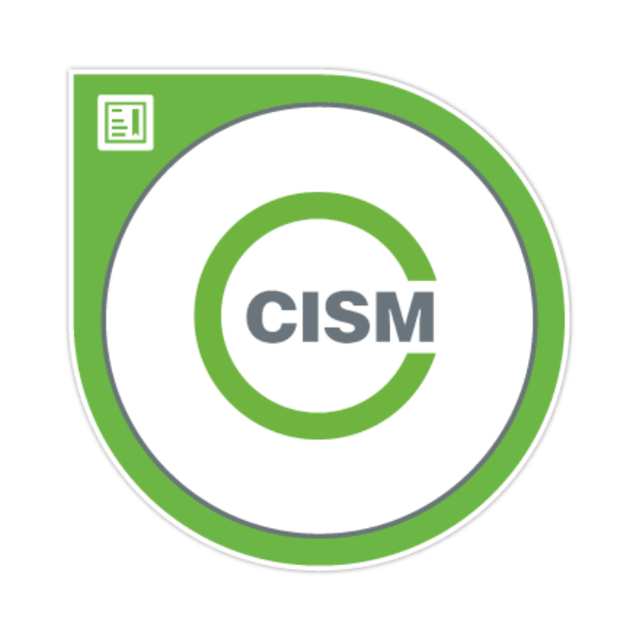

# Hey, I’m Manojit

**`Senior Consultant – Cyber Risk, Strategy & Transformation`**

10+ years of experience driving cyber risk, strategy, and security architecture initiatives across diverse environments, with a background in cybersecurity program development, ISMS implementation and audit, NIST aligned assessments, cyber risk management, and cyber maturity evaluations across global standards and regulatory frameworks.

I am currently expanding my focus onto cloud security architecture, DevSecOps, and AI Security, applying risk-based judgment to cloud-native system design, trust boundaries, and security controls aligned with modern engineering and delivery practices.

---

## My Certifications

[{ width="110" .cert-badge }](https://www.credly.com/badges/8d48a7c7-dfff-4f5d-ac73-6e9a875d2808/public_url)
[{ width="110" .cert-badge }](https://www.credly.com/badges/97ecb02a-87e6-459e-9f12-ec15bb67b704/public_url)
[{ width="110" .cert-badge }](https://learn.microsoft.com/en-us/users/manojitnath-5303/credentials/b98f61174257f80e?ref=https%3A%2F%2Fwww.linkedin.com%2F)
[{ width="110" .cert-badge }](https://www.linkedin.com/in/manojitnath/details/certifications/)

---

## Socials

> **Disclaimer:** All opinions and work shared here are my own and do not represent any past, current, or future employer.

