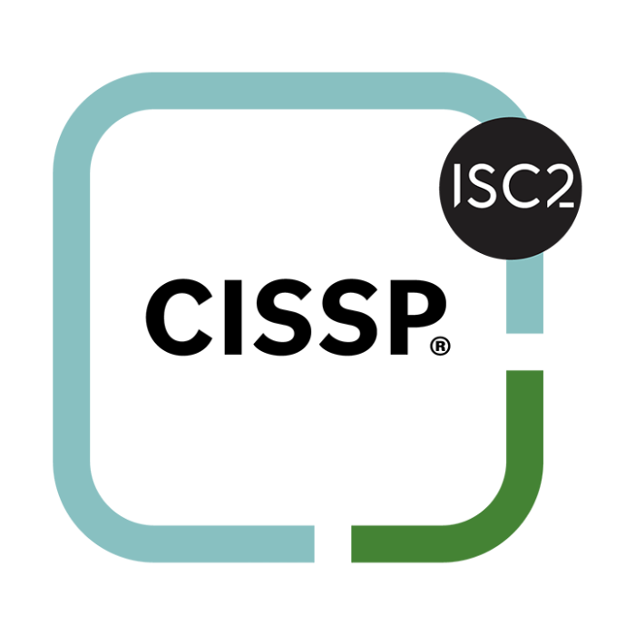
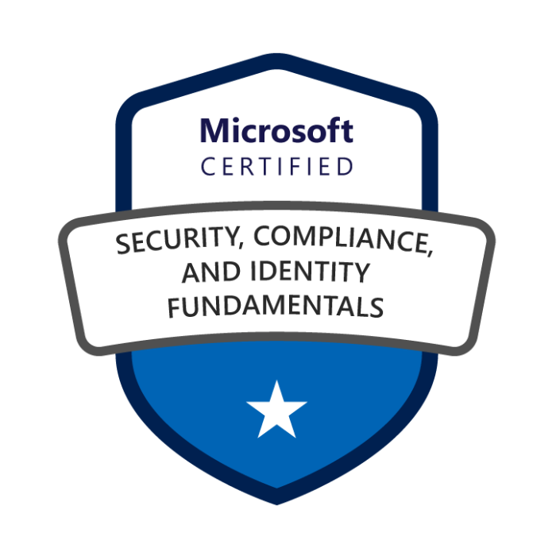

# 👋 Hi, I’m Manojit

**`Senior Consultant – Cyber Risk, Strategy & Transformation`**

10+ years of experience driving cyber risk, strategy, and security architecture initiatives across diverse environments, with a background in cybersecurity program development, ISMS implementation and audit, NIST aligned assessments, cyber risk management, and cyber maturity evaluations across global standards and regulatory frameworks.

I am currently expanding my focus onto cloud security architecture, DevSecOps, and AI Security, applying risk-based judgment to cloud-native system design, trust boundaries, and security controls aligned with modern engineering and delivery practices.

---

## 🎓 Certifications

[{ width="110" .cert-badge }](https://www.credly.com/badges/8d48a7c7-dfff-4f5d-ac73-6e9a875d2808/public_url)
[{ width="110" .cert-badge }](https://www.credly.com/badges/97ecb02a-87e6-459e-9f12-ec15bb67b704/public_url)
[{ width="110" .cert-badge }](https://learn.microsoft.com/en-us/users/manojitnath-5303/credentials/b98f61174257f80e?ref=https%3A%2F%2Fwww.linkedin.com%2F)
[{ width="110" .cert-badge }](https://www.linkedin.com/in/manojitnath/details/certifications/)

<!--

-->

---

## 🔐 Featured Security Projects

Projects that reflect my approach to designing secure architectures and risk-informed systems.

<ul>
<li><a href="https://github.com/manojitnath/risk-to-controls-mapping">Risk-to-Control Mapping</a> <i>ISO 27001, NIST CSF, Risk Management — Mapping business and technical risks to security controls to identify coverage gaps and support risk-informed decision-making.</i></li>
<li><a href="https://github.com/manojitnath/security-architecture-reviews">Security Architecture Reviews</a> <i>Security Architecture, Risk Assessment — Risk-focused reviews of system and vendor architectures evaluating trust boundaries, control adequacy, and alignment to security objectives.</i></li>
<li><a href="https://github.com/manojitnath/cyber-maturity-assessments">Cybersecurity Maturity Assessments</a> <i>NIST CSF, Maturity Models — Cyber maturity assessments highlighting current-state gaps and priority improvement areas across people, process, and technology.</i></li>
</ul>

---

## 📝 Recent Writing

<ul>
  <li><a href="https://theriskmatrix.substack.com/p/placeholder-1">Risk-Based Thinking in Cloud Security Architecture</a> <i>Applying risk management principles to cloud-native system design and trust boundaries.</i></li>
  <li><a href="https://theriskmatrix.substack.com/p/placeholder-2">Bridging GRC and DevSecOps: A Practitioner's View</a> <i>How governance, risk, and compliance integrate with modern DevSecOps workflows.</i></li>
  <li><a href="https://theriskmatrix.substack.com/p/placeholder-3">Threat Modeling for Enterprise Security Programs</a> <i>Practical approaches to integrating threat modeling into existing security programs.</i></li>
  <li><a href="https://theriskmatrix.substack.com/p/placeholder-4">Third-Party Risk Management Beyond Questionnaires</a> <i>Moving from checkbox compliance to risk-informed vendor assessments.</i></li>
</ul>

→ <a href="https://theriskmatrix.substack.com/">View all articles</a>

---

## 🌐 Elsewhere

  
  
  

---

Disclaimer - All opinions and work shared here are my own and do not represent any past, current, or future employer.
